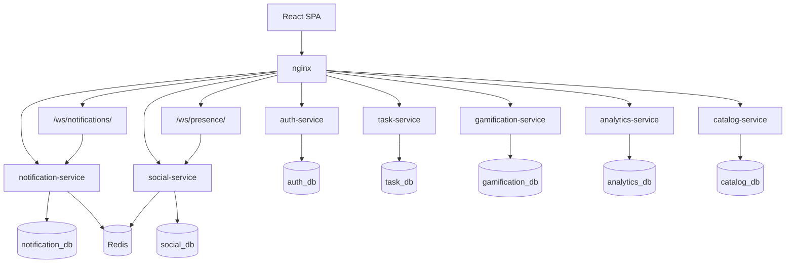

# Microservices Architecture (current)

KiddoPath runs as a **monorepo of Django microservices** behind nginx, plus a React SPA. This doc describes the **current** layout (not the old extract-from-monolith roadmap).

---

## Principles (still locked)

1. **Frontend contract** — same public URLs under `https://localhost/api/...`, stable request/response shapes, stable JWT claims.
2. **JWT** — SimpleJWT + shared `DJANGO_SECRET_KEY` (HS256). Auth-service is the only issuer; other services validate the same secret.
3. **One DB per service** — one Postgres container, separate database names (`auth_db`, `task_db`, …).
4. **Sync HTTP between services** — `X-Internal-Token` for service-to-service calls (no Celery outbox yet).
5. **Scaffold new services** with `./scripts/new-service.sh` + `services/_template/` when needed.

---

## Current architecture



Inside Docker, each Django app listens on **:8000**. Only **nginx** exposes **80/443** to the host.

### Service map

| Service | DB | nginx prefixes | Role |
|---------|-----|----------------|------|
| auth-service | `auth_db` | `/api/auth/`, `/api/kids/`, `/api/guardian-invitations/`, `/admin/`, `/static/` (catch-all `/api/` for auth) | Users, JWT issue, guardians, Google, password reset |
| task-service | `task_db` | `/api/task/` | Tasks, completions, category review settings, AI moderate/classify |
| gamification-service | `gamification_db` | `/api/gamification/` | XP, levels, coins, Honesty, pending rewards |
| analytics-service | `analytics_db` | `/api/analytics/` | Parent per-kid dashboard insights |
| catalog-service | `catalog_db` | `/api/catalog/`, `/media/` | Avatar shop, kid/parent avatars |
| notification-service | `notification_db` | `/api/notification/`, `/ws/notifications/` | In-app notifications + WebSocket |
| social-service | `social_db` | `/api/social/`, `/ws/presence/` | Friends + presence WebSocket |

### Cross-service (sync HTTP today)

Typical chains (not exhaustive):

- **task → gamification** — confirmed completion applies XP/coins (`X-Internal-Token`)
- **gamification → analytics / notification** — activity ingest / level-up notify
- **catalog → gamification** — deduct coins on purchase
- **social → auth / catalog / gamification / notification** — enrich friends, avatars, progress, notify

**Redis** is used for Channels (notifications + presence). **Celery / outbox / RS256** are still **not** used.

**AI** lives inside **task-service** (OpenRouter), not a separate microservice.

---

## Frontend compatibility (auth)

The SPA expects (via `frontend/src/api/auth.ts` and related clients):

| Area | Endpoints | JWT claims |
|------|-----------|------------|
| Parent auth | `/auth/token/`, `/auth/token/refresh/`, `/auth/token/verify/`, `/auth/register/`, `/auth/verify-email/`, `/auth/google/`, `/auth/google/signup/` | `user_id`, `username`, `email`, `kid_ids`, `kids` |
| Kid auth | `/auth/kid/token/`, `/auth/kid/token/refresh/`, `/auth/kid/token/verify/`, `/auth/kid/google/`, `/auth/kid/verify-email/` | `role: "kid"`, `kid_id`, `username` |
| Kid signup | `/kids/signup/`, `/kids/signup/google/check/`, `/kids/signup/google/`, `/kids/invite-parent/` | — |
| Guardian invites | `/guardian-invitations/<token>/`, `/guardian-invitations/accept/` | parent claims |

Do not rename paths or JWT claims without updating the frontend in the same change.

---

## Local run

```bash
cp .env.example .env   # fill secrets, OPENROUTER_API_KEY, etc.
make all               # or: make dev  (admin + Swagger)
```

Useful targets: `make migrate`, `make down`, `make logs`, `make re`.

Swagger/admin only when `make dev` (`DJANGO_DEBUG=true`). Per-service docs: `/api/<service>/docs/` (auth: `/api/docs/`).

---

## How we got here (history, condensed)

| Phase | What happened | Status |
|-------|----------------|--------|
| 1 | Extract **auth-service**, `auth_db`, nginx routing | ✅ |
| 2 | Remove monolith `backend/` | ✅ |
| 3 | Add **task-service** (kid-owned tasks + AI) | ✅ |
| 4+ | Add gamification, analytics, catalog, notification, social; Redis for WebSockets | ✅ |

Older “target 5 services / defer Redis / parent creates tasks” notes are **obsolete**. Prefer this file + the API references below.

---

## Scaffold a new service (if needed)

```bash
./scripts/new-service.sh <slug> <hint-port>
# example:
./scripts/new-service.sh catalog 8004 catalog_db "/api/catalog/"
```

Then wire docker-compose, nginx, Makefile, `.env` DB name, and real APIs. Do not deploy empty stubs.

### When to split again

Split when you have a real feature, its own data, and growing endpoints — not “for architecture.” Prefer sync internal HTTP until async fan-out clearly hurts.

---

## Common pitfalls

- Changing JWT claims or algorithm without frontend updates
- nginx catch-all `/api/` before more specific `/api/task/`, `/api/gamification/`, … routes
- Forgetting `make migrate` for every service
- Sharing one DB across services
- Assuming host ports `8001–8005` — services are Docker-internal `:8000` only

---

## Related docs

Per-service API references:

- [Auth](backend/services_api_references/auth_service_api.md)
- [Task](backend/services_api_references/task_service_api.md)
- [Gamification](backend/services_api_references/gamification_service_api.md)
- [Analytics](backend/services_api_references/analytics_service_api.md)
- [Catalog](backend/services_api_references/catalog_services_api.md)
- [Notifications](backend/services_api_references/notifications_service_api.md)
- [Social](backend/services_api_references/social_service_api.md)

Also: [`schema.sql`](../schema.sql), [`Readme.md`](../Readme.md), [`Developer.md`](../Developer.md)
